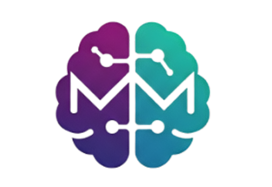

# MindMeh

<p align="left">
  <!-- Tech Stack Badges -->
  
  
  
  
  
  
</p>

<p align="left">
  <!-- Status / Utility Badges -->
  
</p>

## Overview
This project is inspired from the idea that many times we share some of our important youtube, twitter etc links to ourselves in case we need to visit them again. But in reality they usually get scrolled up and have a high possibility of getting lost. To solve this issue MindMeh lets a user to create a brain where they can store such important links at one place and name this brain as per relevance to those links inside it. To know more about features of this website read through the [Key Features](#key-features) section below. 

## Directory Structure
```text
MINDMEH/
├── backend/
│   ├── dist/                      # Compiled typescript files  
│   │   └── index.js               # Compiled express server
│   ├── src/                       
│   │   ├── db/                    
│   │   │   ├── schemas/           # Database schemas definitions
│   │   │   └── db.ts              # Collection models for CRUD operations
│   │   ├── middleware/            # Middlewares for routes
|   |   ├── routes/                # API Endpoints
|   |   ├── scripts/
|   |   │   └── vectorSearchIndex.ts # Creating vector index for vector search 
|   |   ├── types/                 # Types definitions
|   |   ├── utils/                 # Helper functions 
│   │   └── index.ts               # Express server                   
│   ├── .env.example               # Environment variables example 
├── frontend/
│   ├── client/
│   │   ├── node_modules/          # Frontend dependencies
│   │   └── src/
│   │       ├── assets/            # Static assets (images, icons, etc.)
│   │       ├── components/        # Reusable UI & feature components
│   │       │   ├── auth/          # Authentication-related components
│   │       │   ├── brain/         # Brain-related components
│   │       │   ├── content/       # Content rendering components
│   │       │   ├── home/          # Home page components
│   │       │   ├── mindmap/       # Mindmap visualization components
│   │       │   └── ui/            # Shared UI components (toaster)
│   │       ├── context/           # React context providers
│   │       ├── pages/             # Application pages / routes
│   │       ├── types/             # Frontend TypeScript types
│   │       ├── utils/             # Frontend utility functions
│   │       ├── APIclient.tsx      # API abstraction layer (Axios)
│   │       └── App.tsx            # Root React component
└── README.md

```


## Key Features
* Stateless authentication implemented using **JSON Web Tokens** (JWT).
* Allows users to create two types of brain: Public & Private.
* Public brains are accessible to every other user, allowing them to fork in their Private Brains list.
* Users can toggle the visibility of their brains.
* Implemented **Vector Search using Voyage AI** provided by MongoDB to perform **semantic search** on Global Brains (Other's Public Brains).
* Users can add a front cover image to their brains. Image object stored in **Cloudinary**.
* **Pre Signed URL method** used to upload image to Cloudinary reducing load on server.
* Users can add content (important links) related to Youtube, Medium, Reddit, Twitter or some other link. Can give title & description for better understanding.
* For Youtube's content, **thumbnail** of that video will be used as front cover of respective content.
* Generate **MindMap using gemini-2.5-flash** to understand the context of all the URLs inside the brain. 
* Once generated mindmap of a brain, it will be **cached in DB** unless contents inside brains are changed.

## Getting Started
### Prerequisites
* npm ^10.8.1
* node ^24.8.0
* MongoDB cluster
* VoyageAI credentials
* Cloudinary credentials
* Gemini credentials
### Setup
**1. Clone the repository**
```bash
git clone https://github.com/kaisirius/MindMeh.git
```
**2. Setup environment variables**
```bash
cp .env.example .env
# Edit .env with your credentials
```
**3. Run script to create vector index in DB**
```bash
cd backend/src
node .\scripts\vectorSearchIndex.ts
```
**3. Install backend dependencies**
```bash
cd ..
npm install
``` 
**4. Compile & Run HTTP server**
```bash
mkdir dist
npx tsc -b 
npm start
``` 
**5. Install frontend dependencies**
```bash
cd ../frontend/client
npm install
``` 
**6. Run client**
```
npm run dev
``` 
### URLs
* User's Frontend domain : http://localhost:5173
* Backend API domain : http://localhost:3000
## API Endpoints

### Authentication 
* `POST /signup` - Register new user
* `POST /signin` - Login 
* `GET /CheckUser` - Check valid user

### Home page
* `GET /home/brains` - Get all brains of user
* `GET /home/brain/:hash` - Get content for respective brain hash

### View Brain
* `GET /view/brain/:hash` - Get content any brain for view only purpose

### Brain
* `POST /api/v1/brain` - Create new brain
* `POST /api/v1/fork/brain/:hash` - Fork brain
* `GET /api/v1/publicBrains` - Get user's only public brains
* `GET /api/v1/privateBrains` - Get user's only private brains
* `GET /api/v1/globalbrains` - Get Global brains
* `DELETE /api/v1/brain/:hash` - Delete brain
* `PUT /api/v1/brain/:hash` - Update visibility of brain

### Content
* `POST /api/v1/content/:hash` - Add new content in brain
* `DELETE /api/v1/content/:hash/:contentId` - Delete content

### Images
* `GET /api/v1/image/getSignedURL` - Get pre signed URL to upload image
* `GET /api/v1/image/:id` - Get image source URL from DB
* `POST /api/v1/image/uploadURL` - Add image source URL to DB

### MindMap
* `POST /api/v1/brain/mindmap/:hash` - Create MindMap

## Application Flow Diagram 
Below is a rough user flow based on interaction with app.
 

## License
MIT


